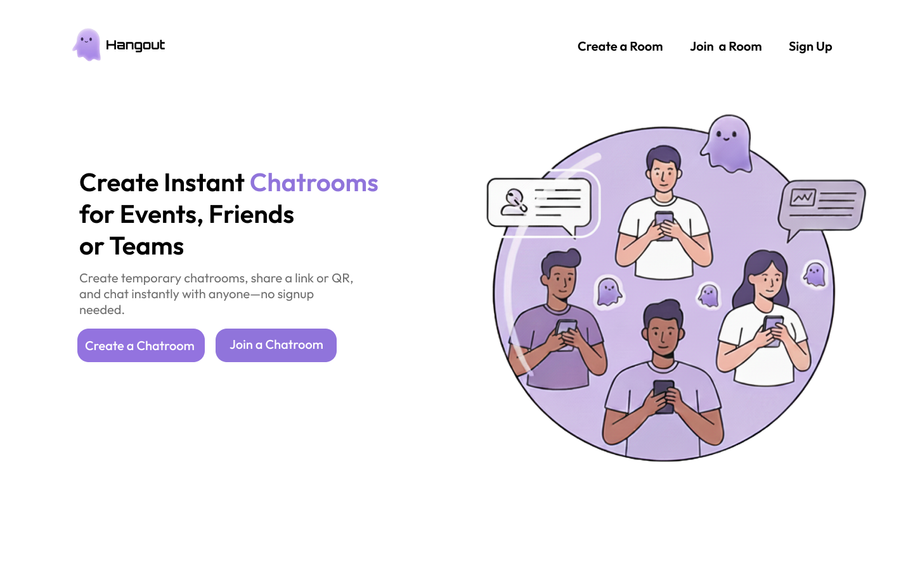
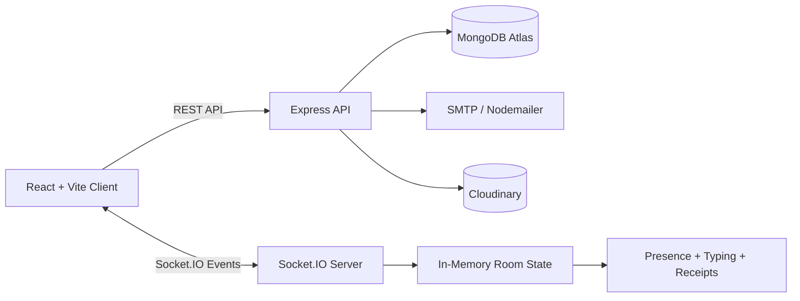

<div align="center">


# SyncChat

### Production-style realtime chatrooms with live presence, typing indicators, image sharing, session control, and message receipts.

SyncChat is a full-stack realtime communication platform built to show more than CRUD: it demonstrates event-driven architecture, WebSocket state synchronization, authenticated user flows, cloud media handling, and scalable realtime-system thinking.


</div>

## Demo Preview

| Landing Experience | Room Creation | Realtime Session |
| --- | --- | --- |
|  |  |  |

## Why This Project Stands Out

Most chat projects stop at "send message and receive message." SyncChat goes further by modeling the realtime details that production messaging systems need:

- **Live presence system**: online/offline state, room-level participant sync, and last-seen timestamps.
- **Typing indicators**: transient socket events that never touch the database but update every connected client.
- **Message lifecycle states**: sent, delivered, and seen updates for outgoing messages.
- **Host-controlled rooms**: timed sessions, participant limits, invite flow, and host-only close controls.
- **Cloud media pipeline**: image upload validation, Cloudinary storage, and realtime image messages.
- **Authentication flow**: JWT cookies, protected API routes, email verification, and password reset OTP.
- **Event-driven backend**: Socket.IO room events coordinate users, timers, messages, delivery receipts, and session shutdown.

## Core Features

| Area | What SyncChat Does |
| --- | --- |
| Realtime Messaging | Broadcasts text and image messages instantly using Socket.IO rooms |
| Presence | Tracks online/offline participants and last-seen status per room |
| Typing State | Shows active typing users with short-lived socket state |
| Read Receipts | Updates outgoing messages through sent, delivered, and seen states |
| Room Control | Hosts create temporary rooms with duration and participant limits |
| Invites | Users can invite participants by email or shareable room link |
| Media Uploads | Supports image messages through Cloudinary and Multer |
| Auth | Includes register, login, logout, verification OTP, and password reset |
| UX | Responsive React UI with animated transitions and mobile room controls |

## Architecture



## Realtime Event Model

| Event | Direction | Purpose |
| --- | --- | --- |
| `joinRoom` | Client -> Server | Join a room and register presence |
| `leaveRoom` | Client -> Server | Leave a room and update last seen |
| `sendMessage` | Client -> Server | Send text or image messages |
| `typing:start` | Client -> Server | Mark the user as actively typing |
| `typing:stop` | Client -> Server | Clear transient typing state |
| `messageDelivered` | Client -> Server | Acknowledge message delivery |
| `messageSeen` | Client -> Server | Acknowledge message visibility |
| `closeSession` | Client -> Server | Host closes the active session |
| `receiveMessage` | Server -> Client | Broadcast message payloads |
| `presenceUpdated` | Server -> Client | Sync online/offline and last-seen state |
| `typing:update` | Server -> Client | Broadcast current typing users |
| `messageStatusUpdated` | Server -> Client | Sync sent/delivered/seen state |
| `sessionTimer` | Server -> Client | Keep all users aligned on remaining time |
| `sessionEnded` | Server -> Client | End the session for all connected clients |

## Tech Stack

| Layer | Tools |
| --- | --- |
| Frontend | React 19, Vite, Tailwind CSS, Framer Motion, React Router |
| Realtime | Socket.IO, socket.io-client |
| Backend | Node.js, Express, CORS, Cookie Parser |
| Database | MongoDB, Mongoose |
| Auth | JWT, bcryptjs, HTTP-only cookies |
| Email | Nodemailer with SMTP credentials |
| Media | Cloudinary, Multer, Multer Cloudinary Storage |
| Tooling | ESLint, Vercel config, npm workspaces by folder |

## System Design Notes

SyncChat currently keeps active realtime room state in memory:

- `participants` stores connected sockets.
- `presence` stores room-visible online/offline state.
- `typing` stores short-lived typing metadata.
- `messages` stores delivery and seen state for the active room session.

That design keeps local development simple while making the next scaling step clear: replace single-process socket state with Redis-backed pub/sub and shared room state.

## Project Structure

```text
syncchat/
|-- client/
|   |-- public/              # Demo images, logos, and static assets
|   |-- src/
|   |   |-- components/      # Modals and reusable UI
|   |   |-- context/         # App auth/backend context
|   |   |-- pages/           # Home, auth, room creation, chatroom
|   |   |-- App.jsx          # Routes
|   |   `-- main.jsx         # React entry point
|   |-- package.json
|   `-- vite.config.js
`-- server/
    |-- config/              # MongoDB, Cloudinary, Nodemailer
    |-- controllers/         # Auth, room, upload, user handlers
    |-- middlewares/         # JWT route protection
    |-- models/              # Mongoose schemas
    |-- routes/              # API routes
    |-- socket/              # Active room state helpers
    |-- utils/               # Room ID generator
    `-- server.js            # Express + Socket.IO entry point
```

## Getting Started

### Prerequisites

- Node.js 18+
- npm 10+
- MongoDB connection string
- SMTP credentials for email
- Cloudinary account for uploads

### Install Dependencies

```bash
cd server
npm install

cd ../client
npm install
```

### Environment Variables

Create `server/.env`:

```env
PORT=4000
NODE_ENV=development
MONGODB_URI=your_mongodb_connection_string
JWT_SECRET=your_long_random_jwt_secret

SMTP_USER=your_smtp_username
SMTP_PASS=your_smtp_password
SENDER_EMAIL=your_verified_sender_email

FRONTEND_URL=http://localhost:5173

CLOUDINARY_CLOUD_NAME=your_cloudinary_cloud_name
CLOUDINARY_API_KEY=your_cloudinary_api_key
CLOUDINARY_API_SECRET=your_cloudinary_api_secret
```

Create `client/.env.local`:

```env
VITE_BACKEND_URL=http://localhost:4000
```

### Run Locally

Start the backend:

```bash
cd server
npm start
```

Start the frontend in another terminal:

```bash
cd client
npm run dev
```

Open `http://localhost:5173`.

## API Overview

| Method | Endpoint | Description |
| --- | --- | --- |
| `POST` | `/api/auth/register` | Create an account |
| `POST` | `/api/auth/login` | Log in and set auth cookie |
| `POST` | `/api/auth/logout` | Clear auth cookie |
| `POST` | `/api/auth/is-auth` | Validate authenticated session |
| `POST` | `/api/auth/send-verify-otp` | Send email verification OTP |
| `POST` | `/api/auth/verify-email` | Verify email using OTP |
| `POST` | `/api/auth/send-reset-otp` | Send password reset OTP |
| `POST` | `/api/auth/reset-password` | Reset password |
| `GET` | `/api/user/data` | Get current user data |
| `POST` | `/api/room/create` | Create a host-controlled room |
| `GET` | `/api/room/:id` | Get room details |
| `POST` | `/api/room/join` | Join a room by ID |
| `POST` | `/api/room/send-invite/:roomId` | Send an email invite |
| `DELETE` | `/api/room/:id` | Close a room |
| `POST` | `/api/upload/photo` | Upload an image message |

## Scripts

| Folder | Command | Purpose |
| --- | --- | --- |
| `client` | `npm run dev` | Start Vite dev server |
| `client` | `npm run build` | Build production frontend |
| `client` | `npm run preview` | Preview production build |
| `client` | `npm run lint` | Run ESLint |
| `server` | `npm start` | Start Express + Socket.IO with Nodemon |

## Verification

```bash
cd client
npm run lint
npm run build

cd ../server
node --check server.js
node --check controllers/roomController.js
```

## Production Upgrade Path

These are the next engineering upgrades that would move SyncChat from single-instance realtime app to production-grade distributed system:

- **Redis Pub/Sub + Socket.IO Redis adapter** for multi-server socket fanout.
- **Protected socket handshake** that validates JWT before a socket joins rooms.
- **Refresh-token rotation** with short-lived access tokens.
- **Google OAuth** for lower-friction authentication.
- **Persistent message model** for chat history, replay, and analytics.
- **WebRTC audio/video calls** with signaling through Socket.IO.
- **S3 or Cloudinary signed uploads** for stronger upload security.
- **Automated tests** for API controllers and socket events.

## Deployment Notes

- Set `FRONTEND_URL` on the server to the deployed client URL.
- Set `VITE_BACKEND_URL` on the client to the deployed backend URL.
- In production, auth cookies use `secure: true` and `sameSite: "none"`, so both frontend and backend must use HTTPS.
- Configure MongoDB, SMTP, and Cloudinary variables in the deployment dashboard.

## License

This project is currently unlicensed. Add a license before distributing or accepting external contributions.
